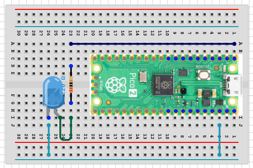

# device-envoy-rp-blinky

[](https://github.com/CarlKCarlK/device-envoy-rp-blinky)
[](https://crates.io/crates/device-envoy-rp)

Minimal blinky project using [`device-envoy-rp`](https://crates.io/crates/device-envoy-rp).

## What This Repo Contains

`src/main.rs` is the default quick start. It blinks SOS on the built-in LED, if available. It blinks on an external LED, otherwise.

## Prerequisites

Before **Quick Start**, install the toolchain in [Toolchain](#toolchain), then return here.

## Quick Start

```bash
git clone https://github.com/CarlKCarlK/device-envoy-rp-blinky.git
cd device-envoy-rp-blinky
git remote remove origin
```

```bash
cargo xtask run --board pico1
```

Supported boards: `pico1`, `pico2`, `pico1w`, `pico2w`.

*`xtask run` always adds `--release`. `xtask check` does not.*

## Setting the Default Board

If you do not want to repeat `--board`, set your project default once in `xtask/src/main.rs` by changing:

```rust
const DEFAULT_BOARD: Board = Board::Pico1;
```

## Main Commands

*This assumes you've set the default to your board; otherwise append `--board YOUR_BOARD`.*

```bash
cargo xtask run
cargo xtask check
cargo xtask build
```

## WiFi Boards (pico1w / pico2w)

The WiFi variants use an external LED on `PIN_1` (active high):

- Pico `PIN_1` → `220Ω` resistor → LED anode (long leg)
- LED cathode (short leg) → `GND`



## Without a Debug Probe

Build first, then convert to a UF2 file:

Pico 1:

```bash
cargo xtask build --board pico1
elf2uf2-rs target/thumbv6m-none-eabi/release/device-envoy-rp-blinky device-envoy-rp-blinky-pico1.uf2
```

Pico 2:

```bash
cargo xtask build --board pico2
elf2uf2-rs target/thumbv8m.main-none-eabihf/release/device-envoy-rp-blinky device-envoy-rp-blinky-pico2.uf2
```

Then for either board:

1. Hold `BOOTSEL` while plugging the board into USB (or hold `BOOTSEL` and tap reset, depending on your board setup).
2. A USB drive like `RPI-RP2` appears.
3. Copy the matching `.uf2` file to that drive.

Without a probe, flashing works, but you will not see runtime log output or be able to debug while the program runs, so we strongly recommend using a debug probe.

## Toolchain

Install Rust from [rustup.rs](https://rustup.rs) if you haven't already.

Install Rust targets:

```bash
rustup target add thumbv6m-none-eabi
rustup target add thumbv8m.main-none-eabihf
```

For debug probe workflow: [`probe-rs`](https://probe.rs/) — recommended; directions on website.

For no-probe flashing workflow, install [`elf2uf2-rs`](https://github.com/JoNil/elf2uf2-rs):

```bash
cargo install elf2uf2-rs
```

Then see [Without a Debug Probe](#without-a-debug-probe) for usage.

## License

Licensed under either:

- MIT license (see LICENSE-MIT)
- Apache License, Version 2.0 (see LICENSE-APACHE)

at your option.
